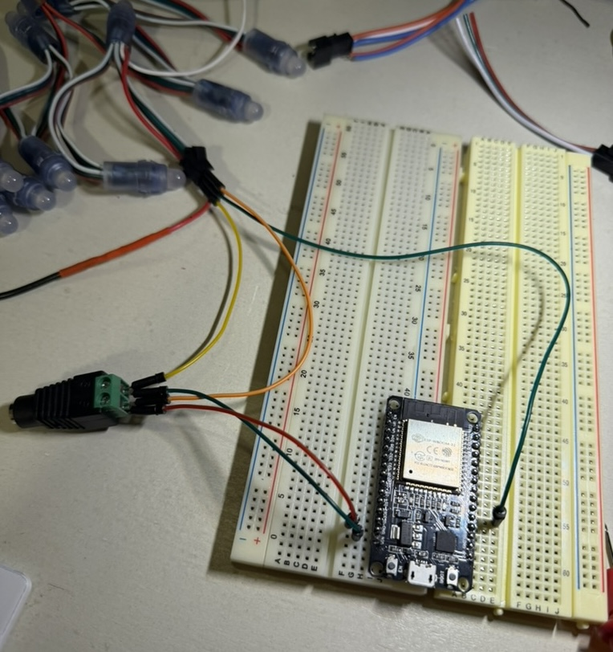
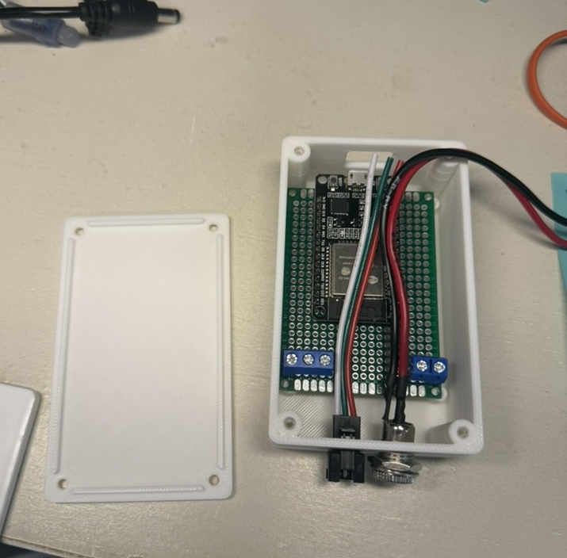
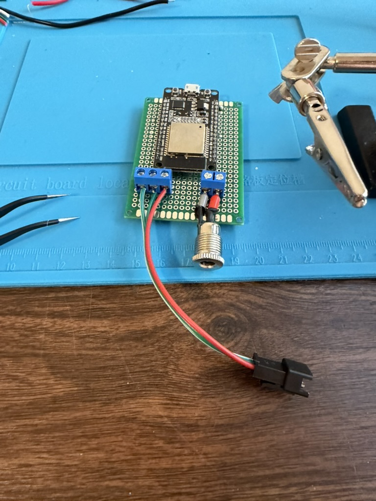
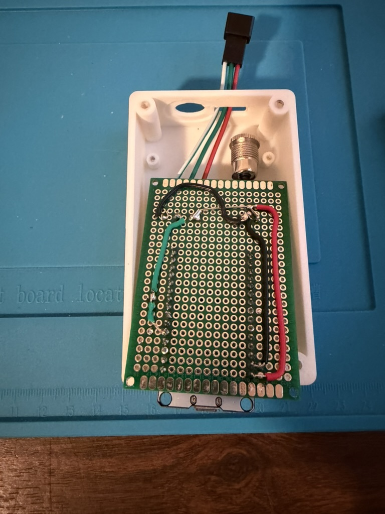
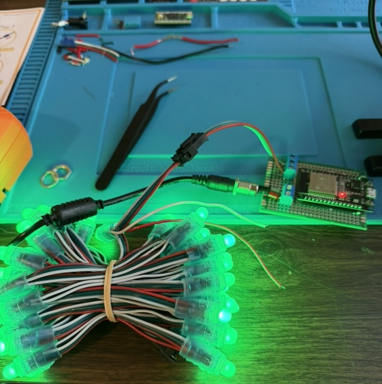

# hatch

## BOM

* esp32 classic: dual-core xtensa, non-mainline rust toolchain
* [WS2811 5V x 50 LED](https://www.amazon.com/gp/product/B01AG923GI/ref=ppx_yo_dt_b_search_asin_title?ie=UTF8&th=1)
* [power supply (5v, 5a, 25w)](https://www.amazon.com/5-5x2-5mm-Industrial-Controllers-5-5x2-1mm-Compatible/dp/B0FDRSWL8T/ref=sr_1_4?crid=4Q7UR7IDSQ9K&dib=eyJ2IjoiMSJ9.6LsA198nV1rmhu5o8rtzIhBG6msqps9CDq5vnT7mJSdrP52IsrjHGf6lpAvbs_TDVY7TSPaKK56a4JrC74WxfF-F-6NBLgMxESUXqmFtStLlbWSolz2FuwGVgamMzmLzjN-8f4VQVVOARQFn0Lv3M9IfKP-eY6BZZisMNdNpjEmr4eUK_7EIWBJza8EHjxx6HFa1nvBKbsF7-9BYD-uapDmqIr50EACpkk2qrAXaPkg.tzG3E6YSgNgVZ3avEK4YuiQ1KSjsqFTxBCmdHrf2Rik&dib_tag=se&keywords=led%2B5v%2B4%2Bto%2B5a%2Bpower%2Bsupply&qid=1790052450&sprefix=led%2B5v%2B4%2Bto%2B5apower%2Bsupply%2Caps%2C156&sr=8-4&th=1)

## Development

The project started on a breadboard. I wanted to verify the ESP32 classic that has been in my electronics box for ~5 years worked. The first step was bringing the board up and turning on a single LED. The board and LED strip were powered by the USB cable at this point. The next step was bringing in a power supply. I used a star pattern out of a barrel terminal jack to power the LED strip and the board. The 3.3v digital logic signal drove the LED strip's data line. This worked across all 50 LEDs in the strip.

The 3D-printed enclosure came next. There is access to the USB port in the rear. THe front has a panel-mounted barrel jack for power and hole for the JST-SM 3-pin LED cable. The tolerances on all of these openings could be better, but it got the job done. There are little standoffs for the PCB to sit on. The lid has nice rails to self-align with the screw posts.

It was then time to solder the circuit down to the protoboard. I decided on simple screw terminals for input power and output power and data. I routed everything on the bottom of the board.

 

Then the first integration test. All 50 pixels were driven to a bright green. The board worked as expected.

